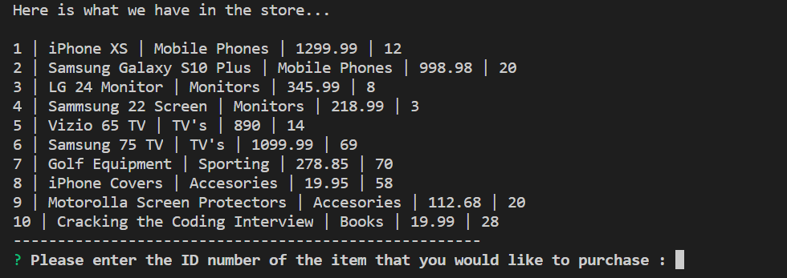
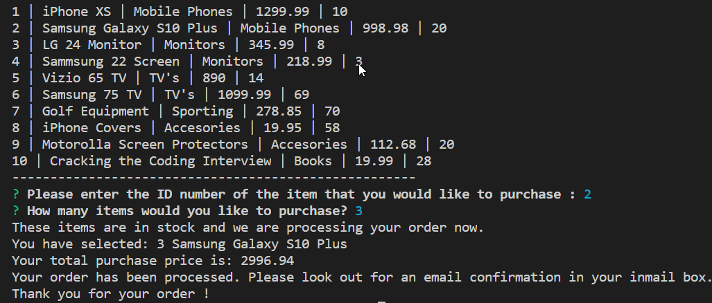
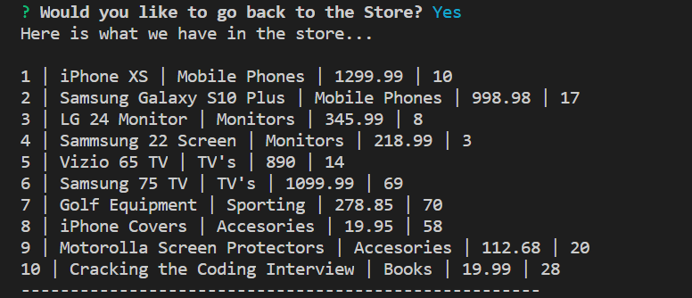
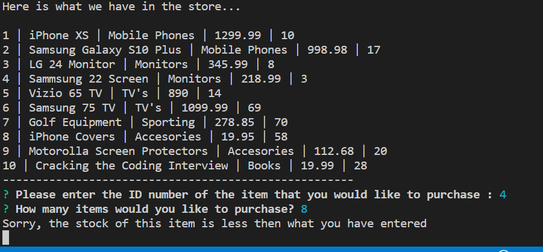

# bamazonApp
**I have created a Node.js app that resembles amazon shopping app **

For this app I used Javascript, Node.js and MySQL Database.

This app utilizes MySQL Database by displaying all available products and the user can select any item to purchase

The app then calculates the total price for the price and updates the DB.

Here are some screenshots of the workflow:

Main Menu showing the current Stock

User has selected Item id and amount of items. Order and Total price is displayed.

Users order was processed and is prompted to see the store again. If you look at the purchased item, it is now updated with the new stock quantity

If user enters a amount of an item that is greater then what we have in stock, the app displays an error.

